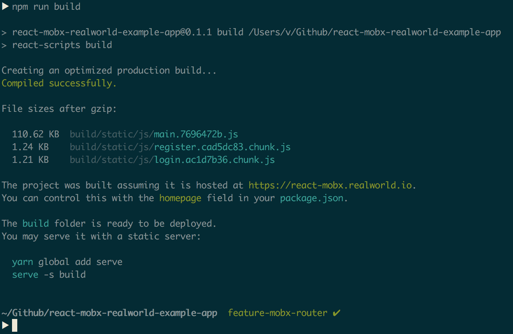

# 

### 替换 react-route 为 mobx-router

主要有一下几点
- 创建路由文件 views
- 对应 react-route 创建 Link 和 NavLink 组件
- 修改 Link 传参方式
- 替换 react-route 中 history, match, location 的调用方式
- 使用 mobx-router 中的 onParamsChange 和 onEnter 来判断 url 中 params 或 queryParams 变化用以刷新
- 新增 react-loadable 用来实现按需加载，并且 react-scripts 中的默认配置会为此分开打包

此外由于 mobx-router 中 url 中传参替换的[正则表达式](https://github.com/kitze/mobx-router/blob/master/src/regex.js)只匹配 '/:', 故先删去了 '/@:username' 中的 @. 到时候向作者提个 issues, 或者自己 fork 改。

# 